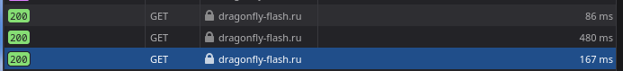
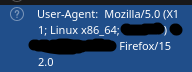

[Инструкция для Firefox](#firefox)
[Инструкция для Chromium, Chrome, Yandex Browser, Edge...](#chromium-chrome-yandex-browser-edge)

## Firefox
1. Если у вас уже открыта панель перейдите к шагу 5
2. Перейдите на свой профиль
3. Нажмите F12
4. если панель снизу, то нажмите на 3 точки справа сверху панели и нажмите на `Dock to Right`
5. Перейдите в вкладку `Network` на верхней панели
6. Нажмите кнопку `Reload` или перезагрузите страницу с открытой панели
7. Нажмите в панели на последний запрос, пример как он должен выглядить: 
8. У вас появится панель справа, листайте пока не найдёте `User-Agent: <USER_AGENT>`, пример: 
9. Нажмите правой кнопкой мыши и нажмите `Copy Value`
10. Готово! У вас в буфере обмена ваш user_agent

## Chromium, Chrome, Yandex Browser, Edge...
1. Если у вас уже открыта панель перейдите к шагу 6
2. Перейдите на свой профиль
3. Нажмите F12
4. Перейдите в вкладку `Network` на верхней панели
5. Нажмите кнопку `Reload page` или перезагрузите страницу с открытой панелью
6. Сверху перейдите в владку `Fetch/XHR`
7. Нажмите на `get_profile?username=<ваш username>&current_user_id=<ваш user_id>`
8. В самом низу будет `User-Agent`
9. Вы нашли User-Agent! Осталось только выделить текст справа  от надписи `User-Agent`